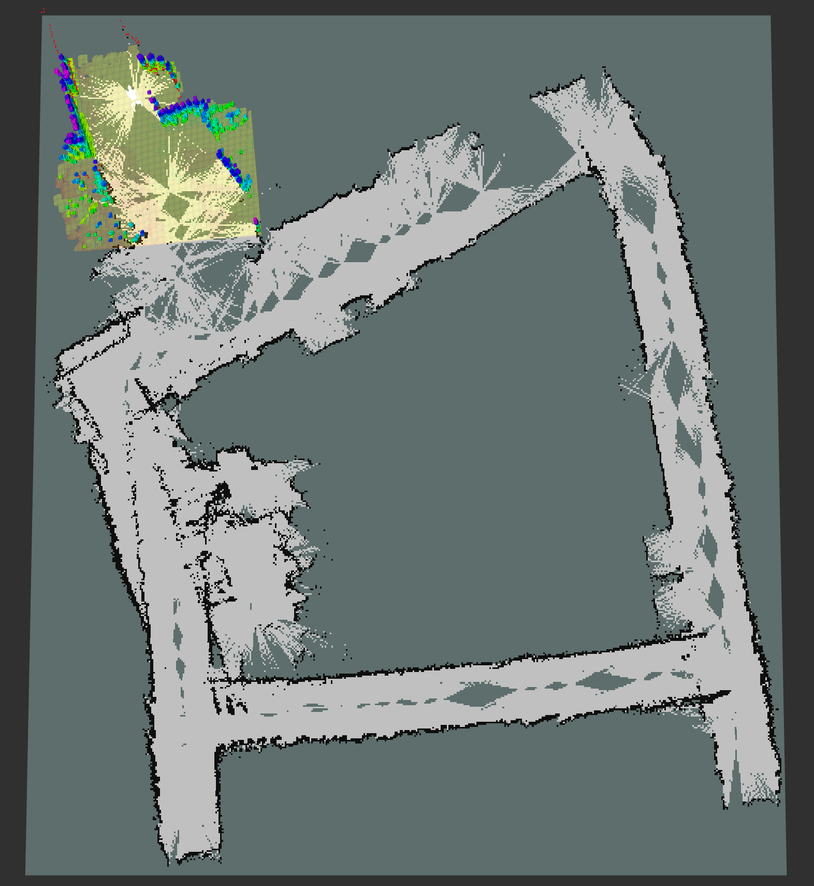

# Projects
**Take a peek at some of the things I've been working on!**

## Methods for Autonomous Navigation of Legged Robots
As a part of my senior design project, I got the opportunity to work on various methods for autonomous navigation on legged robots such as Unitree's Go2 robot. I examined methods such as SLAM, VLMaps, Reinforcement Learning, and more to compare and evaluate their performance.

My senior design group members included myself, [Martha Condori](https://www.linkedin.com/in/martha-condori-032378358/), [Abeshan Javed](https://www.linkedin.com/in/abeshan-javed-6ba1a7265/), and [Marcus Maravilla](https://www.linkedin.com/in/marcus-maravilla-42210630a/), [Grace McPadden](https://www.linkedin.com/in/grace-mcpadden/). Our mentor was [Dr. Jonathan Shihao Ji](https://www.linkedin.com/in/jonathan-shihao-ji-78ab725/).

  

    

      

        
      

      <!-- 

        
      

      

        <video src="your-video.mp4" controls muted loop playsinline></video>
      
 -->
    

  

  <button class="carousel-btn prev">&#8592;</button>
  <button class="carousel-btn next">&#8594;</button>

  

  

<!-- ## Training Graph Neural Networks on Brain Data -->
